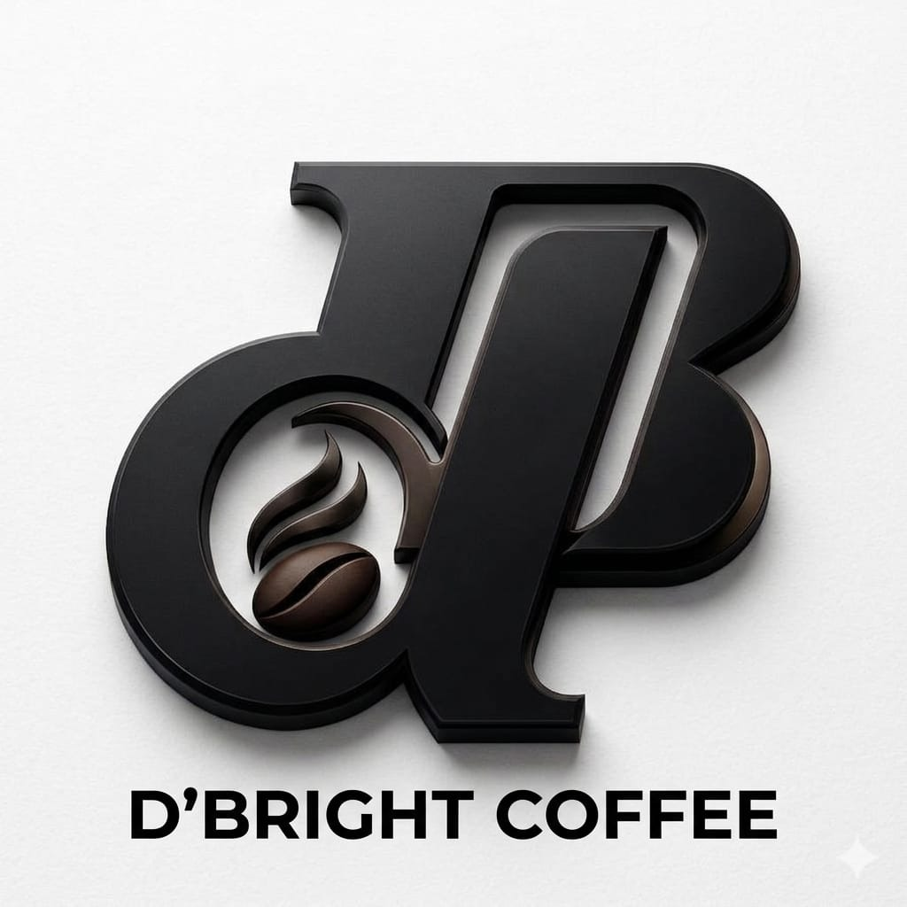

# 🥤 D'BRIGHT COFFEE - Website Promosi Jualan (PHP, Tailwind CSS & jQuery)

<div align="center">


<br>


<br>


### **D'BRIGHT COFFEE - MENU**
**Website Promosi Penjualan Minuman & Snack Berbasis PHP Modular, Tailwind CSS & jQuery**

🌐 **Demo Live URL**: **[https://naylaazzahrah358-beep.github.io/dbright-coffee-tailwind/](https://naylaazzahrah358-beep.github.io/dbright-coffee-tailwind/)**  
👤 **Pengembang**: **Nayla Azzahra R** (Mahasiswi Teknik Komputer FT-UNM, Kelas C - Angkatan 2025)  
📁 **Mata Kuliah**: Praktikum Pemrograman Web

</div>

---

## 📌 Tentang Proyek
Website ini dibangun untuk mempromosikan 24 menu dari **D'BRIGHT COFFEE**, mencakup kategori **Coffee**, **Non Coffee**, dan **Menu Snack** dengan harga bersahabat yang cocok di kantong mahasiswa. Desain menggunakan tema **Cream & Putih**, tata letak lurus elegan (*non-rounded*), serta interaktivitas dinamis berbasis **jQuery** dan **Tailwind CSS**.

---

## 📍 Informasi Outlet & Kontak
- **Alamat Outlet**: Jl. Mustafa Dg. Bunga No.33 Romang Polong, Gowa - Samata
- **WhatsApp Pemesanan**: [0857-0595-2173](https://wa.me/6285705952173)
- **Instagram Resmi**: [@bright_c0ffee](https://instagram.com/bright_c0ffee)
- **Jam Operasional**: Setiap Hari (09.00 - 22.00 WITA)

---

## 📋 Daftar 24 Menu & Harga

### ☕ 1. Kategori COFFEE
1. **Americano (Hot/ice)** - Rp 10.000
2. **Kopi Susu Klasik** - Rp 13.000
3. **Signature D'Bright** - Rp 15.000
4. **Kopi Pandan** - Rp 15.000
5. **Caramel Coffee** - Rp 15.000
6. **Butterscoth** - Rp 15.000
7. **Coffee Latte** - Rp 15.000

### 🍹 2. Kategori NON COFFE
8. **Matcha Latte** - Rp 18.000
9. **Matcha Strawberry** - Rp 23.000
10. **Choco Matcha** - Rp 23.000
11. **Matcha Oreo** - Rp 23.000
12. **Chocolate** - Rp 13.000
13. **Red Velvet** - Rp 13.000
14. **Thai Tea** - Rp 13.000
15. **Taro latte** - Rp 13.000
16. **Lemon/Lyche Tea** - Rp 13.000

### 🍟 3. Kategori MENU SNACK
17. **Kentang Goreng** - Rp 13.000
18. **Ubi Goreng** - Rp 13.000
19. **Roti Bakar** - Rp 15.000
20. **Banana Stick (choco & Tiramisu)** - Rp 13.000
21. **Platter (kentang, sosis, nugget)** - Rp 22.000
22. **Dimsum Mentai** - Rp 20.000
23. **Indomie Biasa** - Rp 8.000
24. **Indomie Komplit** - Rp 13.000

---

## ⚡ Fitur Interaktif Lengkap Menggunakan jQuery
1. **Pencarian Menu Instan (Live Search) & Counter Dinamis**:
   - Mengetik nama menu langsung memfilter kartu secara realtime, dilengkapi penghitung jumlah menu yang tampil dan tombol reset instan.
2. **Filter Kategori Menu Dinamis**:
   - Memfilter kartu menu *Coffee*, *Non Coffee*, dan *Menu Snack* secara instan dengan efek animasi `fadeIn()` dan `hide()`.
3. **Hitung Mundur Promo Harian (Live Countdown Timer)**:
   - Jam hitung mundur otomatis yang berdetak setiap detik menuju jam penutupan promo harian (22:00 WITA).
4. **Status Operasional Outlet Real-Time**:
   - Badge otomatis mendeteksi waktu WITA saat ini untuk menampilkan indikator `● Buka Sekarang` atau `○ Tutup Sementara`.
5. **Accordion FAQ Interaktif**:
   - Tanya jawab yang dapat dibuka dan ditutup dengan efek `slideToggle()`, animasi ikon `+` / `−`, dan active border.
6. **Stepper Jumlah Porsi (+ / -)**:
   - Tombol pengatur kuantitas porsi yang otomatis menyelaraskan dan memperbarui total harga.
7. **Kalkulator Harga Real-time**:
   - Menghitung estimasi total harga secara otomatis pada modal dan form order cepat saat memilih ukuran cup, topping tambahan, dan jumlah porsi.
8. **Salin Alamat & Kontak dengan Feedback**:
   - Tombol copy-to-clipboard dengan umpan balik tombol `Tersalin! ✓` dan notifikasi toast.
9. **Floating Toast Notification**:
   - Pesan feedback melayang di layar saat berinteraksi dengan menu atau menyalin kontak.
10. **Scroll-To-Top Button**:
    - Tombol kembali ke atas yang otomatis muncul saat scroll melebihi 350px dan membawa halaman naik secara halus.
11. **Mobile Menu Drawer**:
    - Toggle navigasi mobile yang responsif menggunakan efek `slideToggle()` dan `slideUp()`.
12. **Integrasi WhatsApp Otomatis**:
    - Membentuk pesan pemesanan terstruktur lengkap dengan rincian pesanan dan total harga siap kirim ke WhatsApp.

---

## 📂 Struktur Berkas Proyek (PHP Modular Architecture)

Proyek ini telah direfaktor menggunakan arsitektur modular PHP yang rapi, dinamis (*DRY - Don't Repeat Yourself*), terintegrasi dengan database MySQL, dan mudah dirawat:

```text
Tailwind css/
├── data/
│   ├── admin_handler.php   # Backend controller aksi admin (Create, Read, Update, Delete menu)
│   ├── db.php              # Konfigurasi koneksi MySQLi (database: tugasnela_db)
│   └── menu_data.php       # Data master fallback: konfigurasi outlet, 24 menu, FAQ, testimoni & helper
├── includes/
│   ├── admin_panel.php     # Panel admin terpadu (modal tambah/edit menu & modal riwayat pesanan)
│   ├── header.php          # Tag head HTML, Tailwind CDN, Google Fonts, Custom CSS & jQuery CDN
│   ├── splash.php          # Splash / opening screen animasi proses seduhan
│   ├── navbar.php          # Top promo bar & navigasi sticky responsif
│   ├── hero.php            # Banner utama & counter statistik menu otomatis
│   ├── marquee.php         # Teks berjalan animasi (Running Marquee)
│   ├── keunggulan.php      # 4 Poin keunggulan produk (looping PHP)
│   ├── menu.php            # Katalog 24 menu interaktif (looping foreach PHP dari database/array)
│   ├── promo.php           # 3 Paket combo hemat & live countdown timer promo
│   ├── cara_pesan.php      # Panduan 3 langkah pemesanan
│   ├── testimoni.php       # Ulasan pelanggan (looping PHP)
│   ├── faq.php             # Accordion FAQ tanya jawab interaktif
│   ├── kontak.php          # Info outlet, form order cepat (opsi menu dinamis PHP) & Google Maps
│   ├── modal.php           # Modal popup formulir pemesanan detail
│   ├── footer.php          # Footer, profil pengembang, scroll-to-top & toast notification
│   └── scripts.php         # Seluruh logika script jQuery & integrasi hotline WhatsApp
├── admin.php               # Shortcut akses langsung panel admin
├── dbright_coffee.sql      # Berkas ekspor database MySQL dari phpMyAdmin (tugasnela_db)
├── index.html              # Berkas versi statis (untuk preview langsung / GitHub Pages)
├── index.php               # Berkas utama aplikasi PHP (menggabungkan semua modul via require_once)
├── pesanan.php             # Halaman riwayat data pesanan masuk pelanggan dari database MySQL
├── process-order.php       # Backend handler pemrosesan formulir pemesanan (metode POST ke database)
├── setup_database.php      # Script otomatis pembuatan database dan tabel menu & pesanan
├── dbright-banner.jpg      # Gambar banner produk resmi
├── dbright-logo.jpg        # Gambar logo resmi D'Bright Coffee
└── README.md               # Dokumentasi lengkap proyek
```

---

## 🗄️ Database MySQL & phpMyAdmin

Proyek ini telah dilengkapi dengan basis data relasional MySQL menggunakan phpMyAdmin:
- **Nama Database**: `tugasnela_db`
- **Tabel 1**: `menu` (Menyimpan 24 item menu makanan & minuman, harga, kategori, badge, dan status unggulan)
- **Tabel 2**: `pesanan` (Menyimpan data pesanan pelanggan, nama, varian, gula, topping, catatan, total harga, dan waktu pemesanan)
- **Berkas Dump SQL**: [`dbright_coffee.sql`](dbright_coffee.sql) *(Hasil ekspor resmi dari phpMyAdmin / MariaDB)*

### 📥 Cara Mengimpor Database via phpMyAdmin:
1. Buka **XAMPP Control Panel**, nyalakan modul **Apache** dan **MySQL** (klik *Start*).
2. Buka browser dan masuk ke **phpMyAdmin**: [http://localhost/phpmyadmin](http://localhost/phpmyadmin).
3. Klik menu **Import** pada navigasi atas phpMyAdmin.
4. Klik tombol **Choose File** / **Pilih Berkas**, lalu pilih berkas [`dbright_coffee.sql`](dbright_coffee.sql) yang ada di folder proyek ini.
5. Gulir ke bawah dan klik tombol **Import** / **Kirim**.
6. Database `tugasnela_db` beserta tabel `menu` (24 data awal) dan `pesanan` otomatis dibuat dan siap digunakan!

> **Opsi Alternatif**: Anda juga dapat menjalankan script setup otomatis dengan membuka browser ke: `http://localhost/dbright-coffee/setup_database.php` atau via terminal: `php setup_database.php`.

---

## 🚀 Cara Menjalankan Secara Lokal

### Cara 1: Menggunakan XAMPP Apache & MySQL (Direkomendasikan)
1. Pindahkan atau salin folder proyek ke dalam direktori `htdocs` XAMPP:
   `C:\xampp\htdocs\dbright-coffee`
2. Buka **XAMPP Control Panel**, lalu klik **Start** pada modul **Apache** dan **MySQL**.
3. Pastikan database telah diimpor sesuai langkah di atas.
4. Buka browser dan akses: **`http://localhost/dbright-coffee`**
5. Untuk mengelola menu dan melihat pesanan, klik tombol **Kelola Menu & Pesanan** di navbar atas atau akses **`http://localhost/dbright-coffee/admin.php`**.

### Cara 2: Menggunakan PHP Built-in Server
1. Buka Terminal / PowerShell di folder proyek ini:
   ```bash
   cd "d:\SEM 3\pemograman web\Tailwind css"
   ```
2. Pastikan MySQL di XAMPP sudah berjalan (*Start* MySQL).
3. Jalankan server bawaan PHP:
   ```bash
   C:\xampp\php\php.exe -S localhost:8000
   ```
   *(Atau ketik `php -S localhost:8000` jika PHP sudah terdaftar di Path).*
4. Buka browser dan akses: **`http://localhost:8000`**

### Cara 3: Membuka Versi HTML Statis
- Cukup klik ganda berkas `index.html` untuk membuka langsung di browser.

---

## 🌐 Repository GitHub

- **Status Repository**: **Publik (Public)**
- **URL Repository**: [https://github.com/naylaazzahrah358-beep/dbright-coffee-tailwind](https://github.com/naylaazzahrah358-beep/dbright-coffee-tailwind)
- **Live Demo (GitHub Pages)**: [https://naylaazzahrah358-beep.github.io/dbright-coffee-tailwind/](https://naylaazzahrah358-beep.github.io/dbright-coffee-tailwind/)

---

## 👩‍💻 Profil Pembuat
- **Nama**: Nayla Azzahra R
- **Program Studi**: Teknik Komputer FT-UNM (Angkatan 2025 - Kelas C)
- **Portofolio Digital**: [https://naylaazzahrah358-beep.github.io](https://naylaazzahrah358-beep.github.io)
- **GitHub**: [@naylaazzahrah358-beep](https://github.com/naylaazzahrah358-beep)
